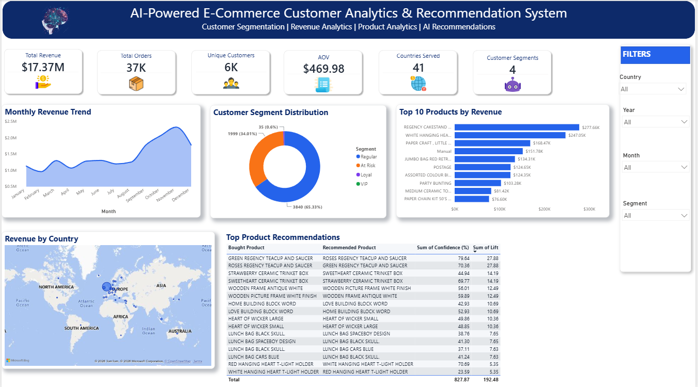
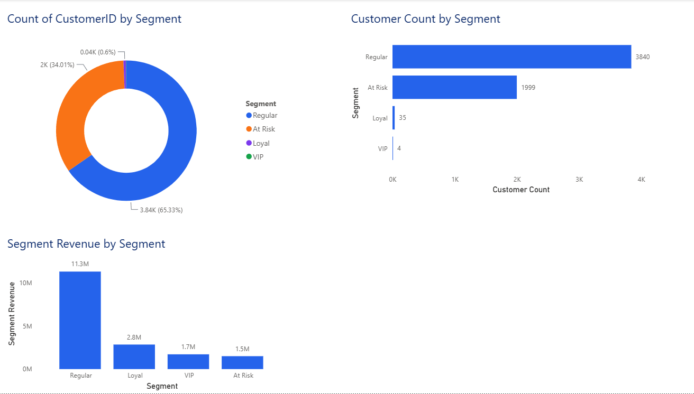
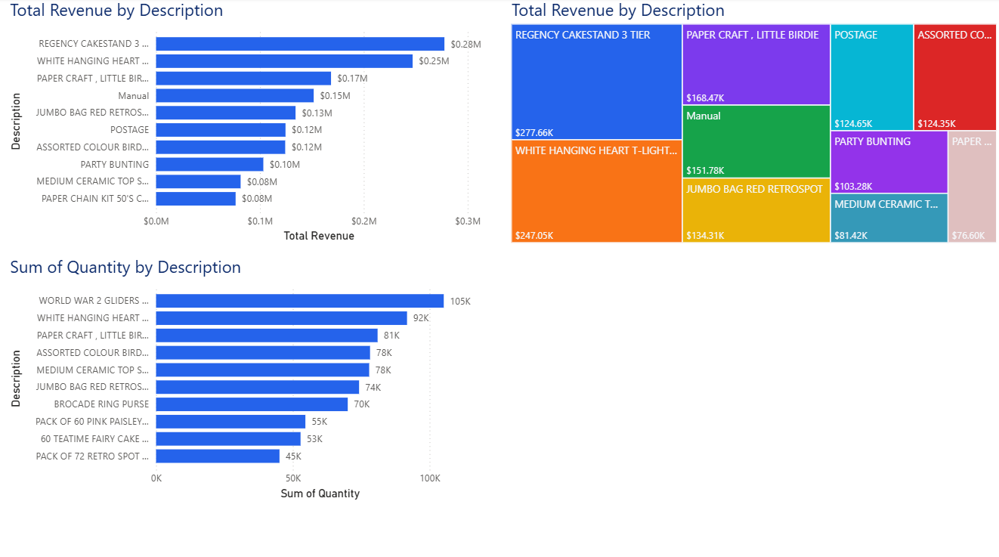
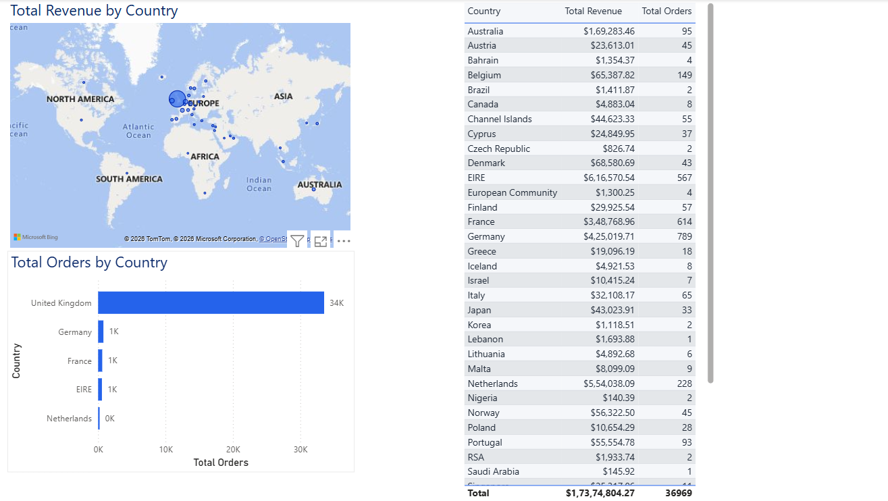
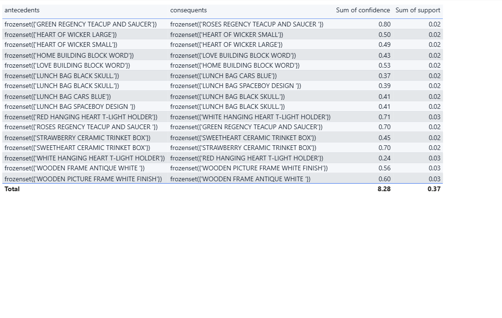
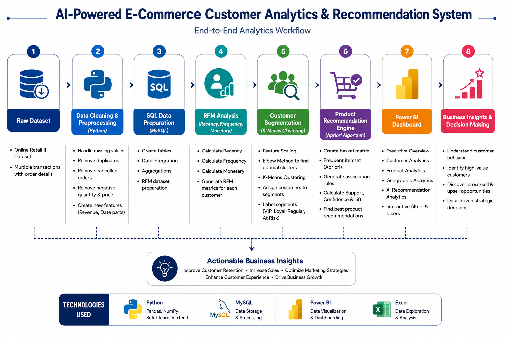

<h1 align="center">🤖 AI-Powered E-Commerce Customer Analytics & Recommendation System</h1>
<p align="center">

<p align="center"><strong>  Customer Segmentation • Product Recommendation • Business Intelligence • Machine Learning</strong>

</p>

<p align="center">
  
</p>

<p align="center">


</p>

---

# 📑 Table of Contents

- Project Overview
- Business Problem
- Technology Stack
- Dashboard Preview
- Project Workflow
- Dataset
- SQL Workflow
- Python Workflow
- Machine Learning
- Power BI Dashboard
- Business Insights
- Repository Structure
- Future Enhancements
- Author

---

# 📌 Project Overview

This project is an end-to-end AI-powered Customer Analytics & Recommendation System built using Python, SQL, Machine Learning, and Power BI.

The solution analyzes customer purchasing behavior, segments customers using RFM Analysis and K-Means Clustering, generates product recommendations using the Apriori Algorithm, and presents business insights through an interactive Power BI dashboard.

The project demonstrates the complete analytics workflow from raw data preprocessing to business intelligence reporting.

---

# 🎯 Business Problem

Retail businesses often struggle to:

- Identify high-value customers
- Understand purchasing behavior
- Improve customer retention
- Increase cross-selling opportunities
- Recommend relevant products
- Support data-driven decision-making

This project addresses these challenges through customer segmentation, recommendation analytics, and interactive business dashboards.

---

# 🛠 Technology Stack

| Category | Technologies |
|----------|--------------|
| Programming | Python |
| Database | MySQL |
| BI Tool | Power BI |
| Data Processing | Pandas, NumPy |
| Machine Learning | Scikit-Learn |
| Recommendation Engine | Apriori Algorithm |
| Data Visualization | Power BI |
| Dataset | Online Retail II |

---

# 📸 Dashboard Gallery

## Executive Overview


---

## Customer Analytics



---

## Product Analytics



---

## Geographic Analytics



---

## AI Recommendation Analytics



---

# 🔄 Project Workflow



---

# 📂 Dataset

Dataset: **Online Retail II**

Contains:

- Customer Transactions
- Invoice Details
- Product Information
- Customer IDs
- Countries
- Quantity
- Unit Price

The dataset was cleaned and transformed before analysis.

---

# 🗄 SQL Workflow

SQL was used for:

- Data Cleaning
- Table Creation
- KPI Calculation
- Revenue Analysis
- Customer Analysis
- Product Analysis
- Data Aggregation

---

# 🐍 Python Workflow

Python was used for:

- Data Cleaning
- Missing Value Handling
- Feature Engineering
- RFM Analysis
- Customer Segmentation
- Product Recommendation

---

# 🤖 Machine Learning

### Customer Segmentation

Algorithm:

- K-Means Clustering

Features Used:

- Recency
- Frequency
- Monetary Value

Customer Segments:

- VIP
- Loyal
- Regular
- At Risk

---

### Recommendation Engine

Algorithm:

- Apriori

Metrics:

- Support
- Confidence
- Lift

---

# 📈 Key Business Insights

- Total Revenue exceeded **$17.37M** across **37K+ orders**.
- Customer segmentation identified **VIP, Loyal, Regular, and At Risk** customer groups using RFM Analysis and K-Means clustering.
- Regular customers generated the highest revenue contribution, indicating opportunities to convert them into loyal customers.
- Product recommendation analysis identified frequently purchased product combinations using the Apriori Algorithm.
- Geographic analysis highlighted revenue distribution across **41 countries**, supporting regional sales strategy.
- Executive KPIs provide a comprehensive view of customer behavior, product performance, and revenue trends.

---

  # ⭐ Project Highlights

✔ End-to-End Data Analytics Project

✔ Customer Segmentation using RFM Analysis

✔ Machine Learning using K-Means Clustering

✔ Product Recommendation using Apriori Algorithm

✔ Interactive Power BI Dashboard

✔ SQL-Based Data Transformation

✔ Python Data Cleaning & Feature Engineering

✔ Executive Business Intelligence Dashboard

---

# 📁 Repository Structure

```text
AI-Customer-Analytics-Recommendation-System
│
├── Data
├── Images
├── SQL
├── Python
├── PowerBI
├── README.md
└── LICENSE
```

---

# 🌟 Future Enhancements

- Deploy the recommendation engine as a web application using Streamlit.
- Integrate real-time sales data for live dashboards.
- Build customer churn prediction models.
- Develop personalized recommendation APIs.
- Deploy the solution on Microsoft Azure or AWS.

---

# 👨‍💻 Author

**Bibhuti Bhusana Patnaik**

📊 Data Analyst | Business Intelligence Enthusiast

🔗 GitHub: [Bibhuti123456](https://github.com/Bibhuti123456)

💼 LinkedIn: [Bibhuti Bhusana Patnaik](https://www.linkedin.com/in/bibhuti-bhusana-patnaik/)

---

⭐ If you found this project helpful, please consider giving it a Star!

Thank you for visiting this repository.
